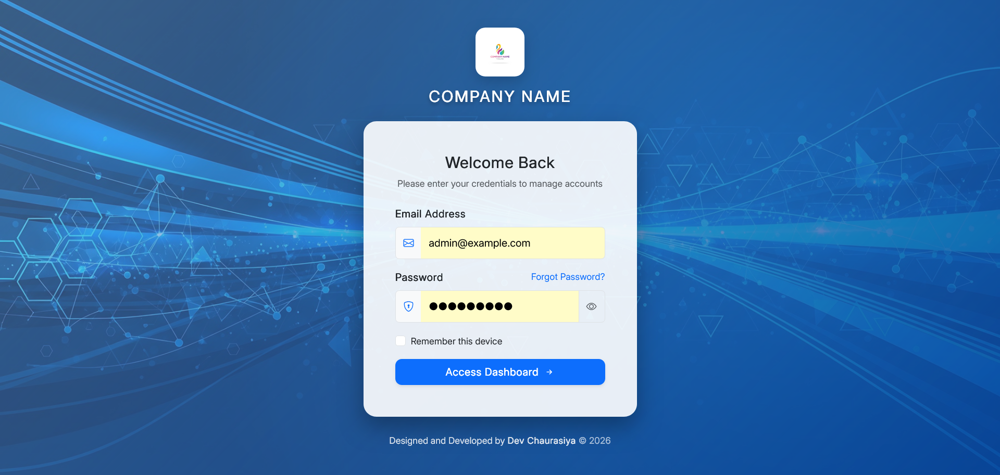
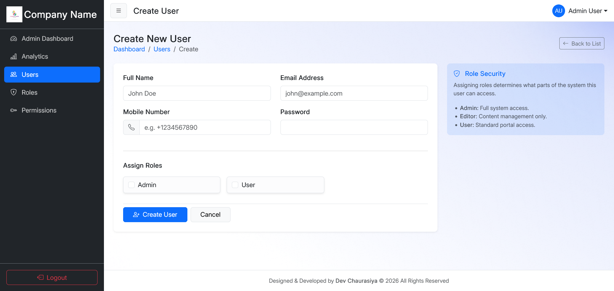
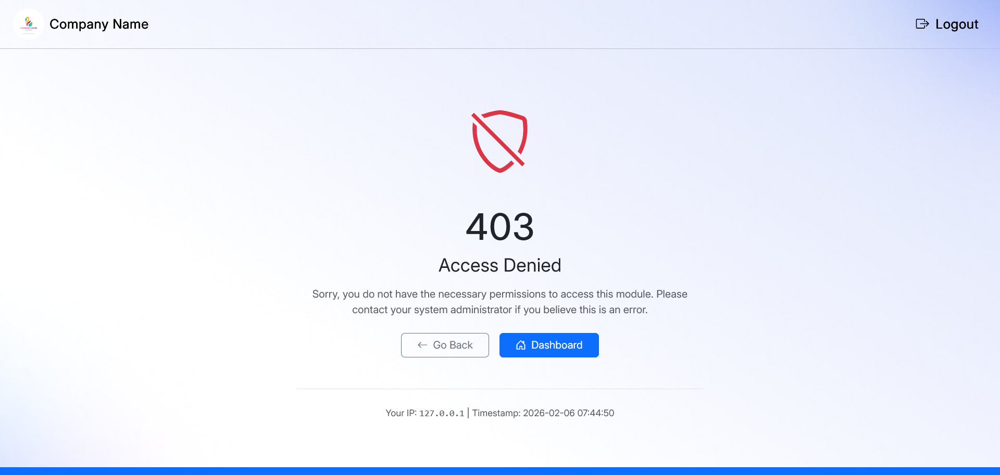

# Laravel 12 Admin Panel (Breeze + Spatie Roles)

A modern Laravel 12 starter admin panel built with **Laravel Breeze authentication**, **Spatie Laravel Permission**, and a clean **Bootstrap + HTML/CSS Blade UI**.

This project includes:
- Authentication (Login/Register/Forgot Password)
- Role & Permission Management
- User Management (CRUD)
- User Activity Logs
- Basic Analytics Dashboard (Blade UI)
- Modern Bootstrap UI

---

## 🚀 Features

### ✅ Authentication (Laravel Breeze)
- Login
- Register
- Forgot Password
- Email verification (optional)
- Profile update

### ✅ Role & Permission (Spatie Laravel Permission)
- Admin / User roles
- Permission-based access control
- Middleware protected routes

### ✅ User Management
- Create / Edit / Delete users
- Assign roles to users
- Filter/search

### ✅ User Logs & Analytics
- Track user actions (login, logout, CRUD actions)
- Analytics dashboard UI in Blade

### ✅ UI
- Bootstrap 5
- Clean admin layout
- Responsive pages

---

## 🛠 Tech Stack
- Laravel 12
- PHP 8.2+ (Recommended)
- Laravel Breeze
- Spatie Laravel Permission
- Bootstrap 5
- MySQL / MariaDB

---

## 🖼 Screenshots

| Login | Admin Dashboard | User Dashboard |
|------|------------------|----------------|
|  |  |  |

---

| Users List | Create User | Roles Management |
|-----------|-------------|------------------|
|  |  |  |

| Create Role | Permissions | Create Permission |
|------------|-------------|-------------------|
|  |  |  |

---

| Profile Settings | Activity Logs | Analytics |
|-----------------|--------------|----------|
|  |  |  |

| Access Denied | Reset Access | Password Change |
|--------------|-------------|----------------|
|  |  |  |


---
## 📦 Installation

### 1️⃣ Clone Repository
```bash
git clone https://github.com/devo7o7/laravel-12-starter-admin-panel.git
cd laravel-12-starter-admin-panel

 2️⃣ Install PHP Dependencies
composer install

3️⃣ Create Environment File
cp .env.example .env

4️⃣ Generate Application Key
php artisan key:generate

5️⃣ Setup Database

Create a database and update your .env file:

DB_CONNECTION=mysql
DB_HOST=127.0.0.1
DB_PORT=3306
DB_DATABASE=laravel_admin
DB_USERNAME=root
DB_PASSWORD=

6️⃣ Run Migrations + Seeders
php artisan migrate --seed

7️⃣ Install Frontend Dependencies
npm install

8️⃣ Build Frontend Assets
npm run build

9️⃣ Run the Application
php artisan serve


Now open:

http://127.0.0.1:8000
